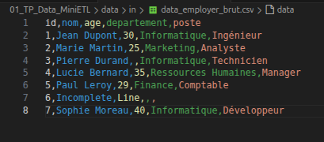
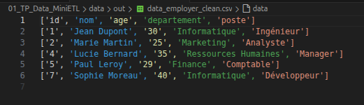

# TP 01 – Nettoyage Jeux de Données 🧹📊

Ce TP a pour objectif d'analyser et de nettoyer :
- Lire un fichier CSV avec des valeurs Corrompus
- Filtrer les Données du CSV
- Nettoyer le jeu de données CSV 
- Transformer en un nouveau jeu de Donnée CSV
- Enregistrer le Nouveau fichier CSV 

---

Ici le Script à pour Entré un fichier CSV avec différents données Brut : 
- Prénom, age, département, et poste de Travail. 

Le fichier est brut est comporte des Erreurs avec des valeurs non valides ou manquantes. 

Le script vient Analyser, et ne récupère que les données comportant tous les élements Valide de 5 Valeurs. 

- Puis on vient Enregistrer ce Nouveau CSV qui est nettoyé et pret à recevoir une Analyse juste.

---

## 📁 Structure
01_TP_Data/
- main.py # Script principal
- data/in # Fichiers d’entrée CSV
- data/out # Fichier CSV Cleaner 
- images/ # Images pour le README

---

## 📊 Données utilisées 

- Fichier : data/in/data_employer_brut.csv
avec pour data : ID, Nom, Age, Département, Poste

Image du Fichier CSV d'entrée : 

Image du Fichier CSV Cleanner en Sortie : 

---

## 📄 Licence
- Ce TP est libre d’utilisation à des fins pédagogiques.