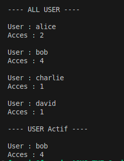

# TP 02 – Analyse de Log Users  🧹📊

Ce TP a pour objectif de :
- Lire un fichier CSV avec des valeurs Corrompus
- Filtrer les Données du CSV
- Determiner les user Actifs qui ont plus de 3 Connexions
- Determiner le nombres d'utilisateurs

---

## 📁 Structure
02_TP_Data/
- analyseloguser.py # Script principal
- images/ # Images pour le README

## 📊 Données utilisées 

- Data use : logs = ["alice", "bob", "alice", "charlie", "bob", "bob", "david", "bob"]

Image du Resultat d'Analyse de Sortie : 

 

## 📄 Licence
- Ce TP est libre d’utilisation à des fins pédagogiques.