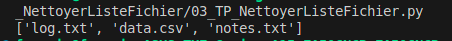

# TP 02 – Nettoyer Fichier 🧹📊

Ce TP a pour objectif de :
- Filtrer la DATA 
- Cleaner la DATA 

---

## 📁 Structure
02_TP_Data/
- nettoyerlistefichier.py # Script principal
- images/ # Images pour le README

## 📊 Données utilisées 

- Data use : fichiers = ["log.txt", "", "log.txt", "data.csv", "temp.tmp", "notes.txt"]

Image du Resultat d'Analyse de Sortie : 

 

## 📄 Licence
- Ce TP est libre d’utilisation à des fins pédagogiques.