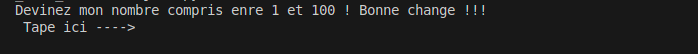
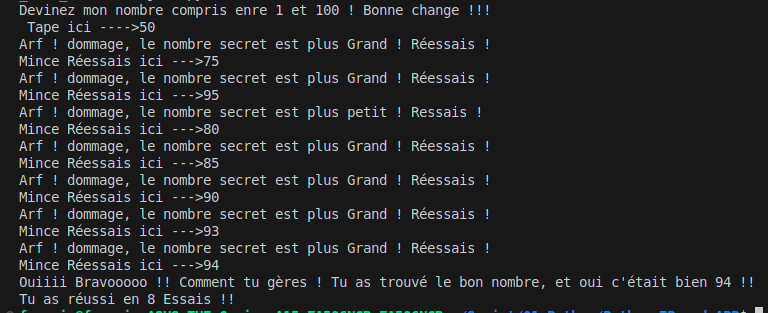

# TP 04 – Jeux Devinette 🧹📊

Ce TP a pour objectif de :
- Créer un mini jeu avec le modume Random
- Manipulation d'Input
- Suivi du Nombre d'essais pour Reussir

---

## 📁 Structure
04_TP_Jeux_Devinette/
- jeux.py # Script principal
- images/ # Images pour le README

---
## Indictation du Jeux 

- Image du Jeux : 

 

 

## 📄 Licence
- Ce TP est libre d’utilisation à des fins pédagogiques.