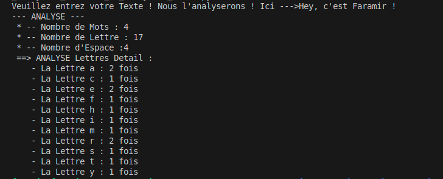

# TP 05 – Analyse de Texte🧹📊

Ce TP a pour objectif de :
- Manipuler les chaines de Caracters
- Manipulation d'un Input 
- Créer une analyse en fonction d'une entree definie 
- Regroupement d'une Analyse Automatique dans une DATA

---

## 📁 Structure
05_TP_Analyseur_Texte/
- Analyseur_Texte.py # Script principal
- images/ # Images pour le README

---
## Indictation de l'Analyseur

 Entré ce que vous souhaitez analyser

 

## 📄 Licence
- Ce TP est libre d’utilisation à des fins pédagogiques.