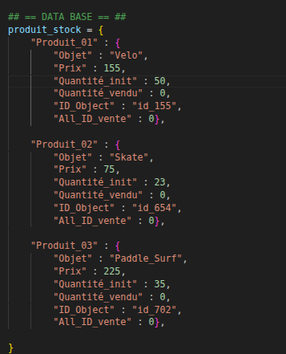
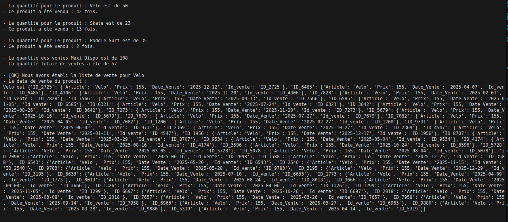
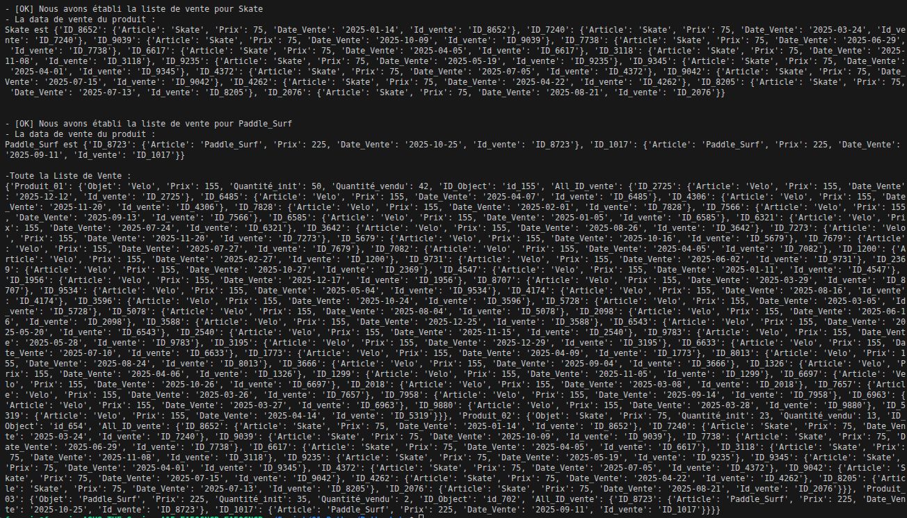

# TP 06 – Creation d'un Jeu de Donnée de Ventes  📊

Objectif du TP : 
- Manipulation de Dictionnaire
- Création d'un Fichier CSV Random basé une Data d'Article. 

---

Ici, nous avons une quantité D'article, aux nombres de 3. 

Produit 01, Produit 02 puis Produit 03 
Chacun comporte ses Données avec : 
- Nom de l'Objet
- Son Prix
- Quantité initial 
- Quantité Vendu
- Id Unique de L'objet 
- Tous les ID de Vente lié à l'Objet

---

Dans la création Random de la DATA de Vente ont prend en compte : 

- On prend en question le Nombre de Quantité Inital qui ne sera jamais dépassé. 
- Une fois la data Créé, on met a jour le Nombre de Quantité Vendu.
- Puis on vient ajouté la liste de Tous les ID Unique de Vente de la data Random. 

- Une fois créé, le jeux de Données sera pret a recevoir une Analyse.

---

## 📁 Structure

02_TP_Data/
- analyseloguser.py # Script principal
- images/ # Images pour le README

---

## 📊 Données utilisées 

- Data utilisé : 

Image de la Data Vente de Sortie : 

---

## 📄 Licence
- Ce TP est libre d’utilisation à des fins pédagogiques.