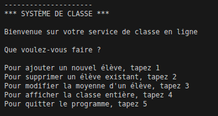
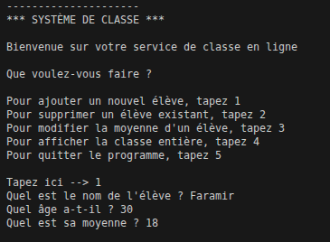
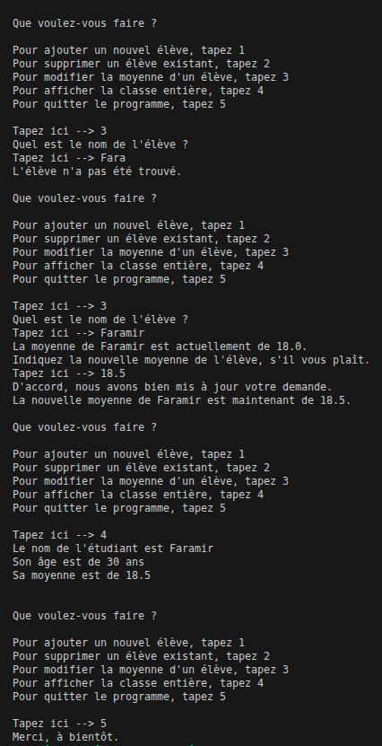

# TP 07 – Systeme Classe Etudiant  📊

Objectif du TP : 
- Création d'un Systeme de Classe d'Etudiant avec DATA et Manipulation

Fonctionnalité à Intégrer : 
- Ajouter un Nouvelle étudiant
- Supprimer un Etudiant Existant
- Modification de la Moyenne
- Affichage de tous les Etudiants de la Classe renseigné
- Quitter le Programme

- Donnée Relatif à l'étudiant : 
    - NOM
    - AGE
    - MOYENNE

---

Mise en Place d'une Gestion d'Erreur dans les Entrées : 
- Moyenne Comprise entre 0 et 20
- Suppression SI dans Nom présent dans la Data Classe
- Input en fonction des données en String, int, Float

---

## 📁 Structure

02_TP_Data/
- main_classe.py # Script principal
- images/ # Images pour le README

---

## Capture du Programme 

Entré dans le Programme de la Classe : 

- On créé un super nouvelle Eleve du nom de Faramir
avec une super moyenne evidemment 

- Puis on test de la modifié en se trompant de nom "Far"
Evidemment ca ne fonctionne pas.. 

- Et si on réessayé en mettant le nom de Faramir voyons...
Biensur que ca fonctionne 

- On modifie donc ca moyenne en rajoutant un petit peu de chiffre.. 

---

## 📄 Licence
- Ce TP est libre d’utilisation à des fins pédagogiques.