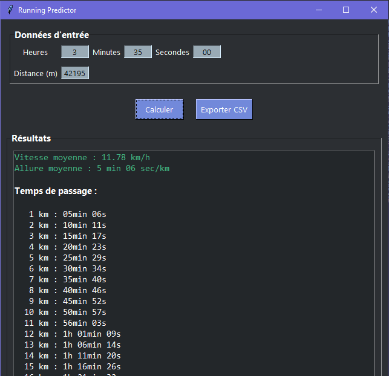
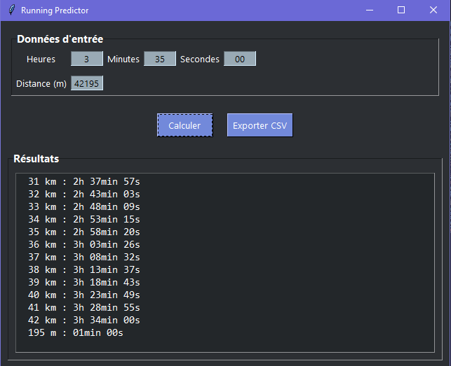
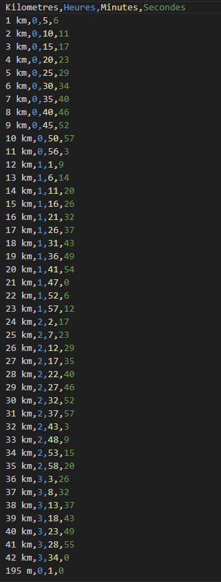

# Running Predictor

## Description

Running Predictor est une application Python simple qui calcule la Vitesse moyenne, Le Pace au Kilo et affiche les temps de passage pour une distance donnée et un temps d’effort renseigné. L’interface utilisateur est réalisée avec Tkinter.

L’application permet également d’exporter les résultats détaillés (temps de passage par kilomètre) au format CSV.

---
## Versions et historique

### Version Clean (stable)
- La version finale et stable de l’application.
- Prête à être utilisée pour un usage courant.
- Disponible dans le fichier `running_predictor.py`.

### Versions de recherche / WIP (Work In Progress)
- Versions exploratoires, expérimentales ou en développement.
- Contiennent des fonctionnalités test ou des modifications non finalisées.
- Disponibles dans le dossier `wip/` 
- Cela regroupe principalement les phases de recherche, code brut en console, passage en fonction, puis sur l'interface avec Tk

## Fonctionnalités

- Calcul de la vitesse moyenne en km/h à partir d’une distance (en mètres) et d’un temps (heures, minutes, secondes).
- Calcul du pace moyen (minutes et secondes par kilomètre).
- Affichage des temps de passage pour chaque kilomètre parcouru.
- Affichage du temps restant pour la fraction de distance finale.
- Interface Interactive avec Tkinter.
- Export des résultats de temps de passage en fichier CSV.

---
## CAPTURE APP Runing Predictor 

# CAPTURE Export CSV 

---
## Prérequis

- Python 3.x
- Tkinter
- Aucun module externe nécessaire

---

## Utilisation
Entrez la durée de course dans les champs Heures, Minutes et Secondes.

Entrez la distance parcourue en mètres.

- Cliquez sur Calculer pour afficher :

    - La vitesse moyenne (km/h)

    - Le pace moyen (min/km)

    - Les temps de passage par kilomètre et la fraction restante

Pour sauvegarder les résultats détaillés, cliquez sur Exporter CSV et choisissez l’emplacement de sauvegarde.

---

## Exemple
Temps : 1h 24min 17sec

Distance : 21095 mètres (semi-marathon)

Résultats affichés :

- Vitesse moyenne : 15.02 km/h

- Allure moyenne : 4 min 00 sec 

- Temps de passage à chaque kilomètre, etc.

