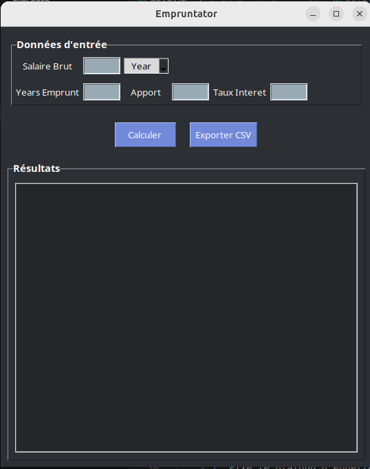
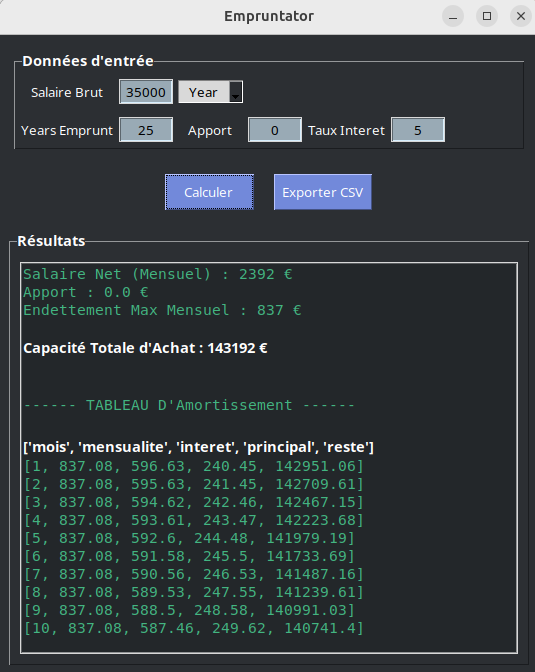
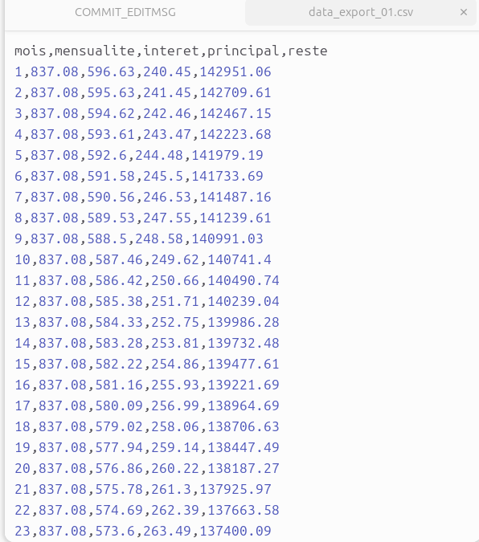

# Empruntator 

Empruntator est une mini‑application  ecrite en Python 3 / Tkinter 
---

# Objectif : 

- Calculer votre capacité maximale d’emprunt à partir d’un salaire brut (mensuel ou annuel)
- Générer automatiquement un tableau d’amortissement mensuel en fonction ( affichage de quelques lignes )
- Exporter ce tableau au format CSV.

---

## Sommaire 

- Fonctionnement Général
- Installation
- Lancement de l'Application
- Utilisation de l’interface
- Détails des formules financières
- Organisation du code & fonctions clés
- Export CSV
- Capture d'Ecran
- Licence

---

## Fonctionnement Général

- Après avoir renseigné vos données (salaire brut, durée du prêt, apport et taux d’intérêt)

    - Convertit le salaire brut en salaire net mensuel (18 % de Charges).
    - Fixe le plafond d’endettement mensuel à 35 % du net mensuel.
    - Calcule le capital total finançable (prêt + apport) via les formules des emprunts à mensualité constante.
    - Établit un tableau d’amortissement détaillant, mois par mois : intérêts, principal et capital restant dû.
    - Permet un export du tableau CSV.

---

# Install 

- Aucun package externe requis mise a part Py.

---

# Lancement de l'Application
- `python empruntator.py`

Une fenêtre “Empruntator” s’ouvre (540 × 640 px).

---

## Utilisation de l’interface 

- Salaire Brut - Montant brut (en €). 
- Year Emprunt - Durée du Pret en Années
- Apport - Votre Apport personnel en €
- Taux Intéret - Taux Nominal annuel ( ex : 3.5 pour 3.5% )
- Menu Month / Year, le type de Salaire Saisi
- Calculer - Lance tous les Calculs et Affiche les Résultats et les 10 premières lignes du Tableau d'Amortissement. 
- Export CSV - Save le Talbeau d'Amoortissement en CSV

---

## Détails des Formules Financière utilsés

- Salaire Net Mensuel : `Net = Brut * ( 1 - 0.18 )`
- Plafond d'Endettement Mensuel : `Cap = 0.35 * net`
- Taux Mensuel : `t = Tannuel / 12*100`
- Capital Financable : `(C = Cap * (1-1+t)**-n )/ t`
- Mensualité Réel : M = `(Ct)/(1-(1+t)**-n)`
- Intéret Mois : Ii = `R(i-1) * t`
- Princiapl Mois = `Pi = M - Ii`
- Nouveau Reste = `Ri = R(i-1) - Pi`

---

## Organisation du code & Fonction cles

- salaire_net_month()
- salaire_net_year()
- calcul_capacite_emprunt()
- calcul_mensualite()
- setup_data()
- exporter_csv()

---

## Export CSV

Le fichier comporte 5 Catégories : 
- mois, mensualite, interet, principal, reste
- puis une ligne par mois jusqu'à échéance final. 

---

## Capture d'Ecran

---

LicenceDistribué sous licence MIT (voir LICENSE).
© 2025 — Empruntator project.
